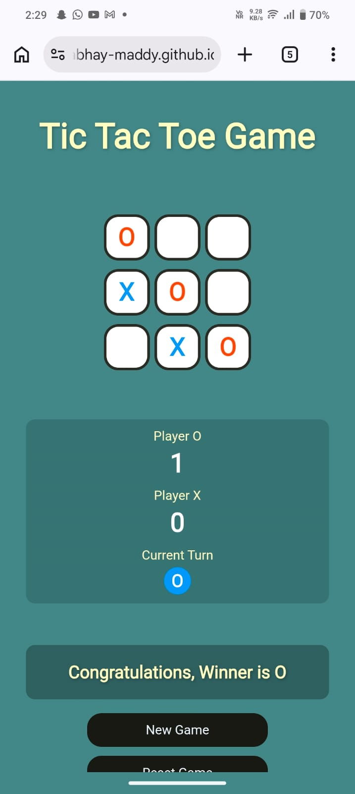
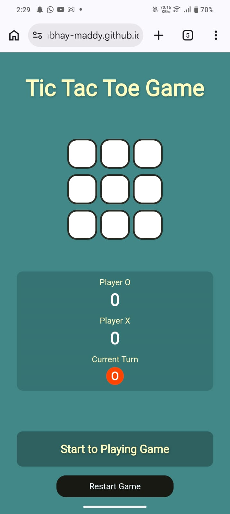
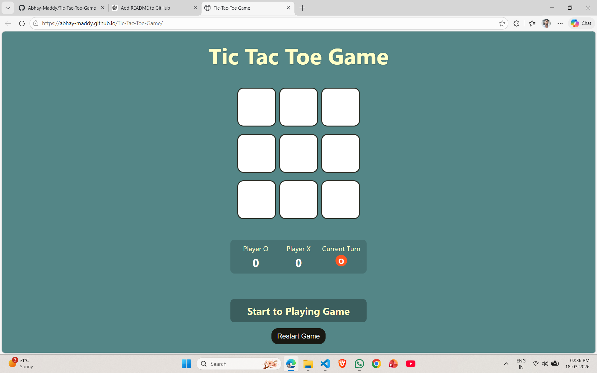
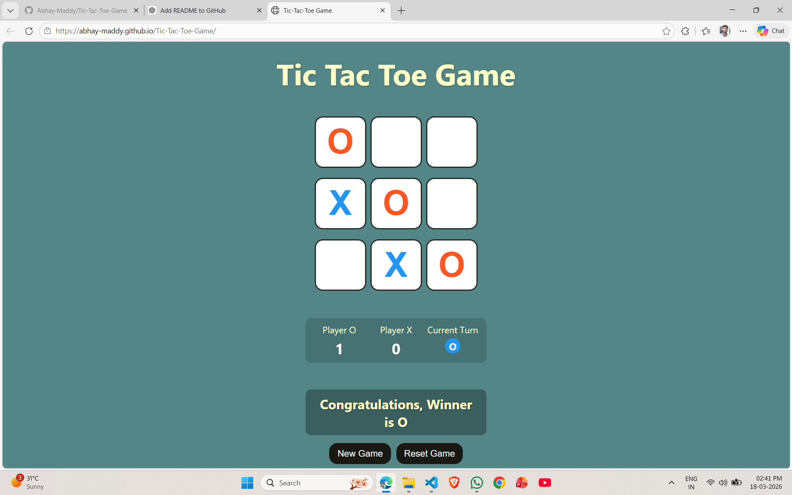

# 🎮 Tic Tac Toe Game

This is a simple and interactive **Tic Tac Toe Game** built using **HTML, CSS, and JavaScript**.  
It is my **first Web Development project**, created to practice DOM manipulation and game logic.

---

## 🚀 Features

- 🎯 Two-player game (Player X vs Player O)
- 🔄 Turn indicator (shows current player)
- 🏆 Winner detection
- 🤝 Draw detection
- 📊 Score tracking for both players
- 🔁 Restart game option
- 🆕 New game (reset scores)
- 📱 Responsive design (works on mobile & desktop)

---

## 🛠️ Technologies Used

- HTML → Structure of the game  
- CSS → Styling and responsiveness  
- JavaScript → Game logic and interactivity  

---

## 📂 Project Structure

Tic-Tac-Toe-Game/
│── index.html  
│── style.css  
│── java.js  

---

## 🎮 How to Play

- Player **O starts first**
- Players take turns clicking boxes
- First player to match:
  - Row
  - Column
  - Diagonal  
  wins the game
- If all boxes are filled → It's a **Draw**

---

## 💡 Future Improvements

- 🤖 Add AI (Play vs Computer)
- 🌐 Online multiplayer
- 🎨 Add animations & sound effects
- 🧠 Difficulty levels

---

## ▶️ Live Preview

### 📱 Mobile View

  
  

---

### 💻 Desktop View

  
  

---

### 🌐 Live Website

👉 https://abhay-maddy.github.io/Tic-Tac-Toe-Game/

## 🙋‍♂️ Author

**Abhay Maddy**

GitHub: https://github.com/abhay-maddy

---

## ⭐ Support

If you like this project, give it a ⭐ on GitHub!

---

## 📌 Note

This project is created for learning purposes and to improve frontend development skills.